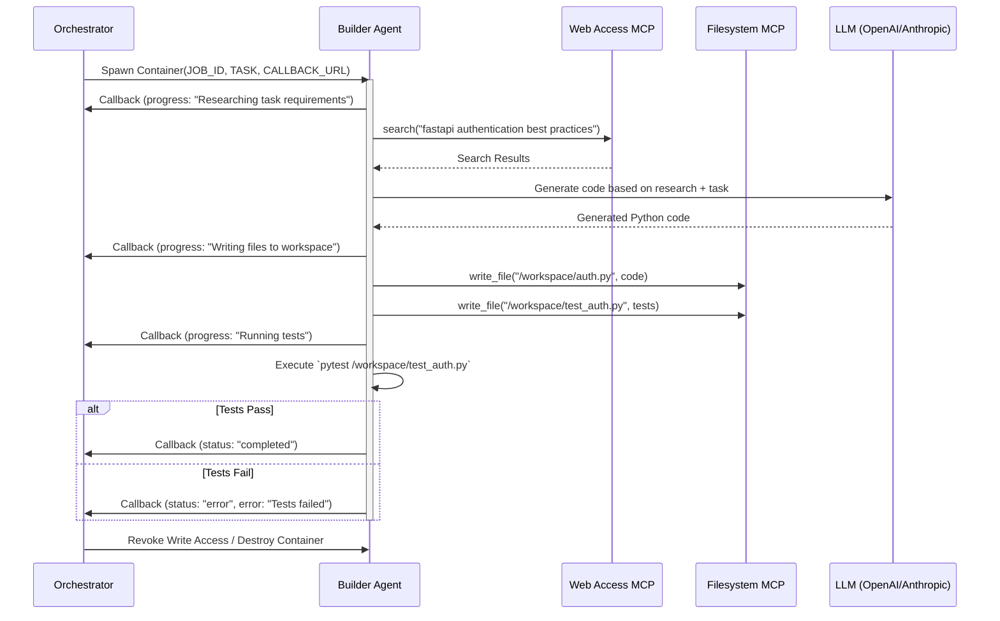

# 🔨 Builder Agent - Autonomous Code Generator

The Builder Agent is ICARUS's creative engine - an autonomous coding agent that researches, generates, and tests code based on natural language task descriptions. It runs in an isolated Docker container with write access to the shared workspace.

## Table of Contents

- [Overview](#overview)
- [Execution Workflow](#execution-workflow)
- [MCP Tool Integration](#mcp-tool-integration)
- [Callback Protocol](#callback-protocol)
- [Environment Variables](#environment-variables)
- [Docker Configuration](#docker-configuration)
- [Development](#development)
- [Troubleshooting](#troubleshooting)

## Overview

### Role in ICARUS

The Builder Agent handles the **Build Phase** of the Trust-but-Verify workflow:

- 🔍 **Research**: Uses web search to find documentation and best practices
- 💻 **Code Generation**: Writes code based on task requirements using LLM
- 📝 **File Operations**: Creates/modifies files in `/workspace`
- 🧪 **Local Testing**: Runs pytest or npm test to validate code
- 📡 **Progress Reporting**: Sends telemetry to Orchestrator via callbacks

### Trust Model

- **Write Access**: Full read/write to `/workspace` volume
- **Network Access**: Whitelisted domains only (PyPI, npm, GitHub, Tavily)
- **Time Limit**: 10-minute timeout (configurable)
- **Resource Limit**: 1 CPU core, 1GB RAM (configurable)

## Execution Workflow

### Agent Lifecycle



### Execution Phases

**Phase 1: Research & Planning**
```python
# Agent searches for documentation
results = await web_access.search("fastapi jwt authentication tutorial")

# Agent analyzes task and creates plan
await report_progress("Researching task requirements...")
```

**Phase 2: Code Generation**
```python
# Agent calls LLM to generate code
await report_progress("Generating code...")
generated_code = await llm.generate(task, context=research_results)
```

**Phase 3: Write to Workspace**
```python
# Agent creates files
await report_progress("Writing files to workspace...")
await create_sample_file()  # Or actual LLM-generated files
```

**Phase 4: Local Testing**
```python
# Agent runs tests
await report_progress("Running tests...")
result = subprocess.run(["pytest", "/workspace/"], capture_output=True)
```

**Phase 5: Completion Signal**
```python
# Signal to orchestrator
await signal_completion()
```

## MCP Tool Integration

The Builder Agent uses Model Context Protocol (MCP) tools for external interactions.

### Web Access MCP

**Purpose**: Research documentation and best practices

**Usage:**
```python
from mcp_tools.web_access import WebAccessMCP

web_access = WebAccessMCP(tavily_api_key=os.getenv("TAVILY_API_KEY"))

# Search for information
results = await web_access.search("python logging best practices")
# Returns: [{"title": "...", "url": "...", "snippet": "..."}]

# Read content from URL
content = await web_access.read("https://docs.python.org/3/library/logging.html")
# Returns: Markdown-formatted text content
```

**Example in Agent:**
```python
async def research_task(self, task: str):
    # Extract keywords from task
    search_query = f"{task} tutorial best practices"
    
    results = await self.web_access.search(search_query)
    
    # Read top 3 results
    documentation = []
    for result in results[:3]:
        content = await self.web_access.read(result['url'])
        documentation.append(content)
    
    return documentation
```

### Filesystem MCP

**Purpose**: Safe file operations in `/workspace`

**Usage:**
```python
from mcp_tools.filesystem import FilesystemMCP

fs = FilesystemMCP(workspace_root="/workspace")

# Write file
await fs.write_file("auth.py", code_content)

# Read file
content = await fs.read_file("auth.py")

# List files
files = await fs.list_dir(".")
# Returns: ["auth.py", "test_auth.py", "__init__.py"]
```

**Safety Features:**
- Path traversal prevented (cannot write to `/etc`, `/home`, etc.)
- All paths resolved relative to `/workspace`
- Automatic directory creation

### GitHub MCP

**Purpose**: Git operations (used post-approval by Orchestrator, not Builder)

The Builder Agent does NOT directly use GitHub MCP. After human approval, the Orchestrator uses it to commit and push code.

## Callback Protocol

The Builder Agent communicates with the Orchestrator via HTTP callbacks.

### Progress Updates

```python
async def report_progress(self, current_tool: str):
    """Report current activity to orchestrator."""
    await httpx.post(
        self.callback_url,  # e.g., http://host.docker.internal:8000/jobs/{job_id}/callback
        json={
            "current_tool": current_tool,
            "cpu_usage": 0.0,  # Optional: actual CPU usage
            "ram_usage_mb": 0.0  # Optional: actual RAM usage
        },
        timeout=5.0
    )
```

**Example Progress Messages:**
- `"Researching task requirements..."`
- `"web_search(python async best practices)"`
- `"Generating code..."`
- `"Writing files to workspace..."`
- `"Running tests..."`

### Completion Signal

```python
async def signal_completion(self):
    """Notify orchestrator that work is complete."""
    await httpx.post(
        self.callback_url,
        json={
            "status": "completed",
            "message": "Builder agent finished successfully"
        },
        timeout=5.0
    )
```

### Error Signal

```python
async def signal_error(self, error_message: str):
    """Report error to orchestrator."""
    await httpx.post(
        self.callback_url,
        json={
            "status": "error",
            "error": error_message
        },
        timeout=5.0
    )
```

## Environment Variables

The Builder Agent receives configuration via environment variables set by the Orchestrator:

```bash
# Required: Set by Orchestrator
JOB_ID=550e8400-e29b-41d4-a716-446655440000
TASK="Create a FastAPI endpoint for user authentication"
ORCHESTRATOR_CALLBACK=http://host.docker.internal:8000/jobs/550e8400-.../callback

# LLM Provider API Key (inherited from Orchestrator)
OPENAI_API_KEY=sk-your-key-here
# or
ANTHROPIC_API_KEY=sk-ant-your-key-here

# Web Search API Key
TAVILY_API_KEY=tvly-your-key-here

# Optional: Git Config
GITHUB_TOKEN=ghp_your-token-here
```

**Note**: `host.docker.internal` allows containers to reach the host machine's localhost.

## Docker Configuration

### Dockerfile

```dockerfile
FROM python:3.11-slim

WORKDIR /app

# Install dependencies
COPY requirements.txt .
RUN pip install --no-cache-dir -r requirements.txt

# Copy agent code
COPY agent.py .

# Set entry point
CMD ["python", "agent.py"]
```

### Resource Limits

Configured in `config/config.yaml`:

```yaml
agents:
  builder:
    image_name: "icarus-builder:latest"
    cpu_limit: 1.0  # 1 CPU core
    memory_limit: 1073741824  # 1GB in bytes
    timeout_seconds: 600  # 10 minutes
    network_mode: "bridge"
```

### Building the Image

```bash
cd icarus/agents/builder
docker build -t icarus-builder:latest .
```

### Manual Testing

```bash
# Run builder manually
docker run --rm \
  -e JOB_ID=test-job-123 \
  -e TASK="Create a hello world function" \
  -e ORCHESTRATOR_CALLBACK=http://host.docker.internal:8000/jobs/test-job-123/callback \
  -e OPENAI_API_KEY=$OPENAI_API_KEY \
  -e TAVILY_API_KEY=$TAVILY_API_KEY \
  -v icarus_workspace:/workspace \
  icarus-builder:latest
```

## Development

### Local Development (Without Docker)

```bash
# Set environment variables
export JOB_ID=local-test-001
export TASK="Create a logging module"
export ORCHESTRATOR_CALLBACK=http://localhost:8000/jobs/local-test-001/callback
export OPENAI_API_KEY=sk-...
export TAVILY_API_KEY=tvly-...

# Run agent
cd icarus/agents/builder
python agent.py
```

### Extending the Agent

Add new functionality by extending the `BuilderAgent` class:

```python
class CustomBuilder(BuilderAgent):
    async def run(self):
        """Override with custom workflow."""
        await self.report_progress("Starting custom workflow")
        
        # Custom logic here
        await self.custom_research()
        await self.custom_code_generation()
        
        await self.signal_completion()
    
    async def custom_research(self):
        # Your custom implementation
        pass
```

### Testing

```bash
# Unit tests for agent
pytest tests/test_agents/test_builder.py

# Integration test with mock orchestrator
pytest tests/integration/test_builder_integration.py
```

## Troubleshooting

### Container Startup Failures

**Problem:** Builder container exits immediately

**Solutions:**
```bash
# 1. Check container logs
docker logs <container_id>

# 2. Verify environment variables are set
docker inspect <container_id> | grep -A 20 "Env"

# 3. Test image can run
docker run --rm icarus-builder:latest python -c "print('OK')"

# 4. Check workspace volume exists
docker volume ls | grep workspace
docker volume inspect icarus_workspace
```

---

### Timeout Errors

**Problem:** Builder agent times out after 10 minutes

**Solutions:**
1. **Increase timeout** in `config/config.yaml`:
   ```yaml
   agents:
     builder:
       timeout_seconds: 1200  # 20 minutes
   ```

2. **Optimize task complexity** - Break large tasks into smaller jobs

3. **Check for infinite loops** in agent code:
   ```bash
   docker exec <container_id> ps aux  # Check process CPU usage
   ```

---

### Callback Issues

**Problem:** "Failed to report progress: Connection refused"

**Solutions:**
1. **Verify callback URL** is accessible from container:
   ```bash
   docker exec <container_id> curl http://host.docker.internal:8000/
   ```

2. **Check orchestrator is running**:
   ```bash
   curl http://localhost:8000/
   ```

3. **Network mode issues** (Windows/Mac):
   - Use `host.docker.internal` instead of `localhost`
   - For Linux, use `--network=host` or custom bridge network

4. **Firewall blocking**:
   - Allow connections on port 8000
   - Check Docker network settings

---

### Web Search Failures

**Problem:** "Web access failed: API key invalid"

**Solutions:**
```bash
# 1. Verify Tavily API key
curl -X POST https://api.tavily.com/search \
  -H "Content-Type: application/json" \
  -d '{"api_key": "'"$TAVILY_API_KEY"'", "query": "test"}'

# 2. Check environment variable in container
docker exec <container_id> env | grep TAVILY

# 3. Regenerate API key at tavily.com
```

---

### File Writing Errors

**Problem:** "Permission denied" when writing to `/workspace`

**Solutions:**
```bash
# 1. Check volume permissions
docker volume inspect icarus_workspace

# 2. Verify container user has write access
docker exec <container_id> touch /workspace/test.txt
docker exec <container_id> ls -la /workspace/

# 3. Recreate volume with correct permissions
docker volume rm icarus_workspace
docker volume create icarus_workspace
```

---

### LLM Integration Errors

**Problem:** "OpenAI API key not found" or "Rate limit exceeded"

**Solutions:**
1. **Verify API key**:
   ```python
   import openai
   openai.api_key = "sk-..."
   print(openai.Model.list())  # Should not error
   ```

2. **Rate limiting** - Implement backoff:
   ```python
   from tenacity import retry, wait_exponential
   
   @retry(wait=wait_exponential(min=1, max=60))
   async def call_llm(prompt):
       return await llm.generate(prompt)
   ```

3. **Switch provider** - Use Anthropic instead:
   ```bash
   export ANTHROPIC_API_KEY=sk-ant-...
   unset OPENAI_API_KEY
   ```

---

## Related Documentation

- [Orchestrator Job Management](../orchestrator/README.md)
- [Checker Agent](../checker/README.md)
- [MCP Tools](../../mcp_tools/README.md)
- [Docker Manager](../orchestrator/docker_manager.py)

---

**Key Takeaway**: The Builder Agent is the creative force of ICARUS. It autonomously researches and generates code, but always within the safety constraints of containerization and the approval gate that follows!
