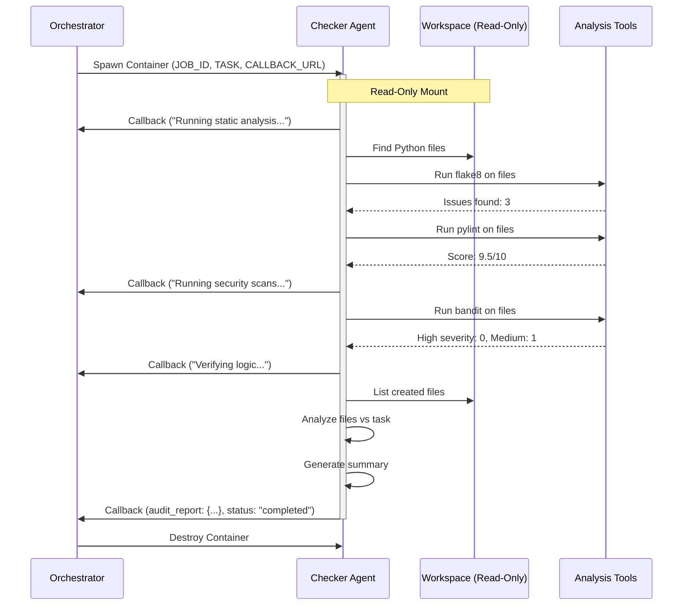

# 🔍 Checker Agent - Code Audit & Security Scanner

The Checker Agent is ICARUS's quality control layer - an autonomous auditing agent that performs static analysis, security scanning, and logic verification on code generated by the Builder Agent. It runs in an isolated Docker container with **read-only** access to ensure audit integrity.

## Table of Contents

- [Overview](#overview)
- [Audit Workflow](#audit-workflow)
- [Audit Tools](#audit-tools)
- [Audit Report Structure](#audit-report-structure)
- [Read-Only Access](#read-only-access)
- [Environment Variables](#environment-variables)
- [Docker Configuration](#docker-configuration)
- [Development](#development)
- [Troubleshooting](#troubleshooting)

## Overview

### Role in ICARUS

The Checker Agent handles the **Audit Phase** of the Trust-but-Verify workflow:

- 🔍 **Static Analysis**: Runs flake8 and pylint to find style and code quality issues
- 🔒 **Security Scanning**: Uses bandit to detect security vulnerabilities
- ✅ **Logic Verification**: Compares generated code against task requirements
- 📊 **Audit Report**: Generates JSON report for human review
- 📡 **Result Reporting**: Sends findings to Orchestrator via callbacks

### Trust Model

- **Read-Only Access**: Cannot modify files in `/workspace` (integrity guarantee)
- **No Network Access**: Isolated from external networks (analysis only)
- **Time Limit**: 5-minute timeout (configurable)
- **Resource Limit**: 0.5 CPU cores, 512MB RAM (configurable)

## Audit Workflow

### Agent Lifecycle



### Execution Phases

**Phase 1: Static Analysis**
```python
await self.report_progress("Running static analysis...")
await self.run_static_analysis()
# Runs: flake8, pylint
```

**Phase 2: Security Scanning**
```python
await self.report_progress("Running security scans...")
await self.run_security_scan()
# Runs: bandit, (TODO: trufflehog for secrets)
```

**Phase 3: Logic Verification**
```python
await self.report_progress("Verifying logic against task...")
await self.verify_logic()
# Compares task requirements with generated files
```

**Phase 4: Report Generation**
```python
self.generate_summary()
# Creates human-readable summary of findings
```

**Phase 5: Send Results**
```python
await self.send_audit_report()
# Sends complete JSON report to Orchestrator
```

## Audit Tools

### flake8 - Python Linter

**Purpose**: Checks style compliance (PEP 8) and syntax errors

**Command:**
```bash
flake8 /workspace/*.py
```

**Example Output:**
```
/workspace/auth.py:15:80: E501 line too long (95 > 79 characters)
/workspace/auth.py:23:1: W293 blank line contains whitespace
```

**In Audit Report:**
```json
{
  "flake8": {
    "issues_count": 2,
    "issues": [
      "/workspace/auth.py:15:80: E501 line too long",
      "/workspace/auth.py:23:1: W293 blank line contains whitespace"
    ]
  }
}
```

---

### pylint - Code Quality Analyzer

**Purpose**: Detects bugs, enforces coding standards, finds code smells

**Command:**
```bash
pylint /workspace/*.py --output-format=json
```

**Example Issues:**
- Unused variables
- Missing docstrings
- Too many arguments
- Complexity warnings

**In Audit Report:**
```json
{
  "pylint": {
    "score": "9.5/10",
    "issues_count": 3,
    "top_issues": [
      {"type": "convention", "message": "Missing module docstring"},
      {"type": "warning", "message": "Unused variable 'temp'"}
    ]
  }
}
```

---

### bandit - Security Linter

**Purpose**: Finds common security issues in Python code

**Command:**
```bash
bandit -f json /workspace/*.py
```

**Detected Issues:**
- Hardcoded passwords
- SQL injection vulnerabilities
- Use of `eval()` or `exec()`
- Insecure cryptographic functions
- Shell injection risks

**In Audit Report:**
```json
{
  "bandit": {
    "high_severity": 0,
    "medium_severity": 1,
    "low_severity": 2,
    "issues": [
      {
        "severity": "MEDIUM",
        "confidence": "HIGH",
        "issue_text": "Use of insecure MD5 hash function",
        "line_number": 45
      }
    ]
  }
}
```

## Audit Report Structure

The Checker Agent generates a comprehensive JSON audit report:

```json
{
  "job_id": "550e8400-e29b-41d4-a716-446655440000",
  "static_analysis": {
    "flake8": {
      "issues_count": 3,
      "issues": ["file.py:10:1: E302 expected 2 blank lines", ...]
    },
    "pylint": {
      "score": "9.5/10",
      "issues_count": 2,
      "top_issues": [...]
    }
  },
  "security_scan": {
    "bandit": {
      "high_severity": 0,
      "medium_severity": 1,
      "low_severity": 3,
      "issues": [...]
    }
  },
  "logic_verification": {
    "files_created": 2,
    "file_list": ["auth.py", "test_auth.py"]
  },
  "summary": "✅ No major issues detected"
}
```

### Summary Messages

**No Issues:**
```
"summary": "✅ No major issues detected"
```

**Style Issues:**
```
"summary": "Issues found: Flake8 found 5 style issues"
```

**Security Issues (Critical):**
```
"summary": "Issues found: ⚠️ Bandit found 2 HIGH severity security issues"
```

**Multiple Issues:**
```
"summary": "Issues found: Flake8 found 5 style issues; ⚠️ Bandit found 1 HIGH severity security issue"
```

## Read-Only Access

### Why Read-Only?

The Checker Agent has read-only access to prevent:
- ❌ Tampering with code to hide issues
- ❌ Modifying audit reports
- ❌ Circumventing security checks

### Implementation

**Docker Mount:**
```python
# In docker_manager.py
mounts = [
    docker.types.Mount(
        target="/workspace",
        source=workspace_volume,
        type="volume",
        read_only=True  # Checker cannot write
    )
]
```

**Verification:**
```bash
# Inside Checker container
touch /workspace/test.txt
# Output: touch: cannot touch '/workspace/test.txt': Read-only file system
```

## Environment Variables

```bash
# Required: Set by Orchestrator
JOB_ID=550e8400-e29b-41d4-a716-446655440000
TASK="Create a FastAPI endpoint for user authentication"
ORCHESTRATOR_CALLBACK=http://host.docker.internal:8000/jobs/.../callback
```

**Note**: Checker does NOT need LLM API keys (no code generation, only analysis).

## Docker Configuration

### Dockerfile

```dockerfile
FROM python:3.11-slim

WORKDIR /app

# Install linting and security tools
RUN pip install --no-cache-dir \
    flake8 \
    pylint \
    bandit

# Install dependencies
COPY requirements.txt .
RUN pip install --no-cache-dir -r requirements.txt

# Copy agent code
COPY agent.py .

CMD ["python", "agent.py"]
```

### Resource Limits

Configured in `config/config.yaml`:

```yaml
agents:
  checker:
    image_name: "icarus-checker:latest"
    cpu_limit: 0.5  # 0.5 CPU cores
    memory_limit: 536870912  # 512MB
    timeout_seconds: 300  # 5 minutes
    network_mode: "bridge"
```

### Building the Image

```bash
cd icarus/agents/checker
docker build -t icarus-checker:latest .
```

### Manual Testing

```bash
# Run checker manually
docker run --rm \
  -e JOB_ID=test-job-123 \
  -e TASK="Create authentication" \
  -e ORCHESTRATOR_CALLBACK=http://host.docker.internal:8000/jobs/test-job-123/callback \
  -v icarus_workspace:/workspace:ro \
  icarus-checker:latest
```

**Note**: `:ro` flag ensures read-only mount.

## Development

### Local Development (Without Docker)

```bash
# Set environment variables
export JOB_ID=local-test-001
export TASK="Create a logging module"
export ORCHESTRATOR_CALLBACK=http://localhost:8000/jobs/local-test-001/callback

# Install audit tools
pip install flake8 pylint bandit

# Run agent
cd icarus/agents/checker
python agent.py
```

### Adding New Audit Tools

Extend the `CheckerAgent` class:

```python
async def run_security_scan(self):
    """Run security scanning tools."""
    results = {}
    
    python_files = list(self.workspace.rglob("*.py"))
    
    if python_files:
        results['bandit'] = self.run_bandit(python_files)
        results['trufflehog'] = self.run_trufflehog()  # NEW
    
    self.audit_report['security_scan'] = results

def run_trufflehog(self) -> Dict:
    """Scan for secrets in git history."""
    result = subprocess.run(
        ["trufflehog", "filesystem", str(self.workspace)],
        capture_output=True,
        text=True
    )
    # Parse and return results
    return {"secrets_found": 0}
```

### Testing

```bash
# Unit tests
pytest tests/test_agents/test_checker.py

# Integration test
pytest tests/integration/test_checker_integration.py

# Test with sample code
mkdir /tmp/test_workspace
echo "print('hello')" > /tmp/test_workspace/test.py
# Run checker on /tmp/test_workspace
```

## Troubleshooting

### Tool Installation Failures

**Problem:** "flake8: command not found" inside container

**Solutions:**
```bash
# 1. Verify tools are installed in image
docker run --rm icarus-checker:latest flake8 --version
docker run --rm icarus-checker:latest pylint --version
docker run --rm icarus-checker:latest bandit --version

# 2. Rebuild image with tools
cd icarus/agents/checker
docker build --no-cache -t icarus-checker:latest .

# 3. Check Dockerfile includes installations
grep -A 5 "RUN pip install" Dockerfile
```

---

### Permission Errors

**Problem:** "Permission denied" when reading files

**Solutions:**
```bash
# 1. Check volume mount is read-only (should be!)
docker inspect <container_id> | grep -A 10 "Mounts"

# 2. Verify file permissions in workspace
docker run --rm -v icarus_workspace:/workspace:ro alpine ls -la /workspace

# 3. Container user permissions
docker exec <container_id> whoami
docker exec <container_id> id
```

---

### Report Generation Issues

**Problem:** Audit report is empty or malformed

**Solutions:**
1. **Check logs** for tool execution errors:
   ```bash
   docker logs <checker_container_id> | grep -i error
   ```

2. **Verify Python files exist** in workspace:
   ```bash
   docker run --rm -v icarus_workspace:/workspace:ro alpine find /workspace -name "*.py"
   ```

3. **Test tools manually**:
   ```bash
   docker exec <container_id> flake8 /workspace/
   docker exec <container_id> pylint /workspace/*.py
   docker exec <container_id> bandit -r /workspace/
   ```

4. **Validate JSON output**:
   ```python
   import json
   audit_report = {...}
   print(json.dumps(audit_report, indent=2))  # Should not error
   ```

---

### Callback Failures

**Problem:** "Failed to send audit report: Connection refused"

**Solutions:**
```bash
# 1. Test callback URL from container
docker exec <container_id> curl -X POST \
  http://host.docker.internal:8000/jobs/test/callback \
  -H "Content-Type: application/json" \
  -d '{"test": true}'

# 2. Verify orchestrator is accessible
curl http://localhost:8000/

# 3. Check network configuration
docker network inspect bridge

# 4. For Linux, use host network
docker run --network=host ...
```

---

### Timeout Issues

**Problem:** Checker times out on large codebases

**Solutions:**
1. **Increase timeout** in `config/config.yaml`:
   ```yaml
   agents:
     checker:
       timeout_seconds: 600  # 10 minutes
   ```

2. **Optimize tool execution** - Run in parallel:
   ```python
   import asyncio
   
   async def run_all_audits(self):
       await asyncio.gather(
           self.run_static_analysis(),
           self.run_security_scan(),
           self.verify_logic()
       )
   ```

3. **Limit file scanning** - Skip large files or dependencies:
   ```python
   python_files = [
       f for f in self.workspace.rglob("*.py")
       if "site-packages" not in str(f)
   ]
   ```

---

## Related Documentation

- [Builder Agent](../builder/README.md)
- [Orchestrator Approval Flow](../../orchestrator/README.md)
- [Audit Report Format](../../orchestrator/models.py)

---

**Key Takeaway**: The Checker Agent is the guardian of code quality. Its read-only access ensures audit integrity, and its comprehensive tooling catches issues before they reach production!
