# 🛡️ System Sentinel - Resource Monitor & Protection

The System Sentinel is ICARUS's protective layer, continuously monitoring host resources to prevent system lockup during autonomous operations. It enforces graduated alert levels and can automatically pause containers during critical resource conditions.

## Table of Contents

- [Overview](#overview)
- [Alert Levels](#alert-levels)
- [Monitoring Architecture](#monitoring-architecture)
- [Configuration](#configuration)
- [Integration](#integration)
- [Development](#development)
- [Troubleshooting](#troubleshooting)

## Overview

### Purpose

The Sentinel prevents resource exhaustion by:
- ✅ **Continuous Monitoring**: Tracks CPU, RAM, and disk usage every 5 seconds
- 🟡 **Yellow Alerts**: Stops accepting new jobs at 80% resource usage
- 🔴 **Red Alerts**: Automatically pauses all ICARUS containers at 90% usage
- 🔄 **Auto-Recovery**: Resumes containers when resources return to normal

### Why It's Critical

Without the Sentinel, autonomous agents could:
- Consume all system RAM, causing OS to freeze
- Max out CPU, making the host unresponsive
- Fill disk space, preventing logging and database writes

The Sentinel ensures ICARUS never takes down your development machine.

## Alert Levels

### 🟢 GREEN - Normal Operation

**Trigger**: CPU < 80% AND RAM < 80%

**Actions:**
- Accept new jobs normally
- All containers running
- Routine monitoring continues

---

### 🟡 YELLOW - High Resource Usage

**Trigger**: CPU ≥ 80% OR RAM ≥ 80%

**Actions:**
- **Stop accepting new jobs** (queued jobs wait)
- Existing containers continue running
- Log warning to console and Discord (if configured)
- Monitor more aggressively

**Example Log:**
```
⚠️ YELLOW ALERT: System resources at 82.3%
CPU: 75.1% | RAM: 82.3%
New job submissions should be paused until resources are freed
```

---

### 🔴 RED - Critical Resource Usage

**Trigger**: CPU ≥ 90% OR RAM ≥ 90%

**Actions:**
- **Pause ALL ICARUS containers** immediately
- Log critical alert
- Send urgent Discord notification (if configured)
- Track paused containers for auto-resumption

**Example Log:**
```
🚨 RED ALERT: System resources CRITICAL at 91.5%
CPU: 88.2% | RAM: 91.5%
Pausing 2 active ICARUS containers
Paused container: icarus_builder_a3f2 (ID: d4e5f6g7)
Paused container: icarus_checker_b8c1 (ID: h9i0j1k2)
Red alert mitigation complete: Paused 2 containers
```

**Recovery**: When resources drop below 80%, containers are automatically resumed.

## Monitoring Architecture

### State Machine


### Monitoring Loop

```mermaid
sequenceDiagram
    participant Sentinel
    participant psutil
    participant Docker
    participant Logger
    participant Orchestrator
    
    loop Every 5 seconds
        Sentinel->>psutil: get CPU/RAM/Disk stats
        psutil-->>Sentinel: {cpu: 85%, ram: 78%, disk: 45%}
        
        alt Max Usage ≥ 90% (RED)
            Sentinel->>Docker: list containers (name=icarus_*)
            Docker-->>Sentinel: [container1, container2]
            loop For each container
                Sentinel->>Docker: pause(container_id)
                Sentinel->>Sentinel: track paused_container
            end
            Sentinel->>Logger: CRITICAL - Red Alert
            Sentinel->>Orchestrator: Notify (resources critical)
            
        else Max Usage ≥ 80% (YELLOW)
            Sentinel->>Logger: WARNING - Yellow Alert
            Sentinel->>Orchestrator: Notify (stop new jobs)
            
        else Max Usage < 80% (GREEN)
            alt Was in RED
                Sentinel->>Docker: unpause(all tracked containers)
                Sentinel->>Logger: INFO - Cleared alerts
            end
        end
    end
```



## Configuration

### Environment Variables

```bash
# Sentinel Thresholds (percentage)
SENTINEL_YELLOW_THRESHOLD=80
SENTINEL_RED_THRESHOLD=90

# Polling Interval (seconds)
SENTINEL_POLL_INTERVAL=5

# Enable/Disable Sentinel
SENTINEL_ENABLED=true
```

### config.yaml

```yaml
sentinel:
  enabled: true
  yellow_threshold: 80  # CPU/RAM percentage
  red_threshold: 90
  poll_interval_seconds: 5
```

### Recommended Thresholds

| System RAM | Yellow | Red  | Reasoning |
|-----------|--------|------|-----------|
| 8GB       | 85%    | 95%  | Less headroom, more aggressive |
| 16GB      | 80%    | 90%  | Default, balanced |
| 32GB+     | 75%    | 85%  | More aggressive prevention |

**Note**: Set thresholds based on your system and other running applications.

## Integration

### Orchestrator Integration

The Orchestrator queries Sentinel before spawning new containers:

```python
from sentinel.monitor import SystemMonitor

# Initialize Sentinel
sentinel = SystemMonitor(
    yellow_threshold=80.0,
    red_threshold=90.0,
    poll_interval=5,
    docker_manager=docker_manager
)

await sentinel.start()

# Check before spawning job
if sentinel.current_status == "RED":
    raise ServiceUnavailable("System resources critical - cannot spawn job")
```

### Querying System Stats

```python
from sentinel.monitor import SystemMonitor

sentinel = SystemMonitor()
stats = sentinel.get_system_stats()

print(f"CPU: {stats['cpu_percent']}%")
print(f"RAM: {stats['ram_percent']}% ({stats['ram_used_gb']:.1f}GB used)")
print(f"Disk: {stats['disk_percent']}% ({stats['disk_free_gb']:.1f}GB free)")
```

**Example Output:**
```json
{
  "timestamp": "2026-02-07T16:35:00Z",
  "cpu_percent": 45.2,
  "cpu_count": 8,
  "ram_percent": 62.5,
  "ram_total_gb": 16.0,
  "ram_available_gb": 6.0,
  "ram_used_gb": 10.0,
  "disk_percent": 48.3,
  "disk_total_gb": 256.0,
  "disk_free_gb": 132.4
}
```

### Manual Alert Triggering (for testing)

```python
# Simulate high load
await sentinel._trigger_yellow_alert(stats)
await sentinel._trigger_red_alert(stats)

# Clear alerts
await sentinel._clear_alerts()
```

## Development

### Running Standalone

```python
import asyncio
from sentinel.monitor import SystemMonitor

async def main():
    sentinel = SystemMonitor(
        yellow_threshold=80.0,
        red_threshold=90.0,
        poll_interval=5
    )
    
    await sentinel.start()
    
    # Run for 60 seconds
    await asyncio.sleep(60)
    
    await sentinel.stop()

asyncio.run(main())
```

### Testing

```bash
# Run Sentinel tests
pytest tests/test_sentinel/

# Test with stress tool (Linux/Mac)
stress --cpu 8 --timeout 30s  # Trigger yellow/red alerts
```

### Adding Custom Alerts

Extend `SystemMonitor` to add custom alert actions:

```python
class CustomSentinel(SystemMonitor):
    async def _trigger_yellow_alert(self, stats: Dict):
        await super()._trigger_yellow_alert(stats)
        
        # Custom action: Send email
        await send_email_alert(
            subject="ICARUS Yellow Alert",
            body=f"Resources at {max(stats['cpu_percent'], stats['ram_percent'])}%"
        )
```

## Troubleshooting

### False Yellow Alerts

**Problem:** Sentinel triggers yellow alerts during normal operation

**Solutions:**
1. **Adjust thresholds** - Increase `SENTINEL_YELLOW_THRESHOLD`:
   ```bash
   # In .env
   SENTINEL_YELLOW_THRESHOLD=85
   ```

2. **Check for other processes** - Identify resource hogs:
   ```bash
   # Windows
   tasklist /v | sort /R /+65
   
   # Linux/Mac
   top -o %CPU
   htop
   ```

3. **Increase poll interval** to reduce sensitivity:
   ```bash
   SENTINEL_POLL_INTERVAL=10  # Check every 10 seconds
   ```

---

### Stuck Containers After Red Alert

**Problem:** Containers remain paused after resources drop

**Solutions:**
1. **Manually unpause**:
   ```bash
   docker unpause $(docker ps -a --filter "status=paused" --filter "name=icarus_" -q)
   ```

2. **Check Sentinel logs** for auto-resume errors:
   ```bash
   # Search orchestrator logs for sentinel errors
   grep "Failed to resume container" logs/*.log
   ```

3. **Verify current status**:
   ```python
   from sentinel.monitor import SystemMonitor
   sentinel = SystemMonitor()
   print(f"Current status: {sentinel.current_status}")
   print(f"Paused containers: {sentinel.paused_containers}")
   ```

---

### High Resource Usage Not De tected

**Problem:** System is slow but Sentinel shows GREEN

**Solutions:**
1. **Check psutil installation**:
   ```bash
   python -c "import psutil; print(psutil.cpu_percent(interval=1))"
   ```

2. **Verify polling is running**:
   ```python
   # Check _monitoring_task status
   print(sentinel._monitoring_task)  # Should not be None
   ```

3. **Test manual stats retrieval**:
   ```python
   stats = sentinel.get_system_stats()
   print(f"CPU: {stats['cpu_percent']}%, RAM: {stats['ram_percent']}%")
   ```

---

### Sentinel Not Starting

**Problem:** Sentinel fails to initialize

**Solutions:**
1. **Check Python version** (requires 3.11+):
   ```bash
   python --version
   ```

2. **Verify dependencies**:
   ```bash
   pip list | grep psutil
   pip install --upgrade psutil
   ```

3. **Check Docker connection** (if DockerManager provided):
   ```python
   import docker
   client = docker.from_env()
   print(client.ping())  # Should return True
   ```

---

### Alerts Not Clearing

**Problem:** System returns to normal but status stays YELLOW/RED

**Solutions:**
1. **Restart Sentinel**:
   ```python
   await sentinel.stop()
   await sentinel.start()
   ```

2. **Check for stuck monitoring loop**:
   ```bash
   # Review orchestrator logs for monitoring exceptions
   tail -f logs/orchestrator.log | grep "Monitoring loop"
   ```

3. **Force status reset**:
   ```python
   sentinel.current_status = "GREEN"
   await sentinel._clear_alerts()
   ```

---

## Related Documentation

- [Orchestrator Integration](../orchestrator/README.md)
- [Docker Manager](../orchestrator/docker_manager.py)
- [Alert Configuration](../config/README.md)

---

**Key Takeaway**: The Sentinel is your safety net. It ensures ICARUS never becomes a resource hog that freezes your machine. Adjust thresholds based on your hardware and workflow!
